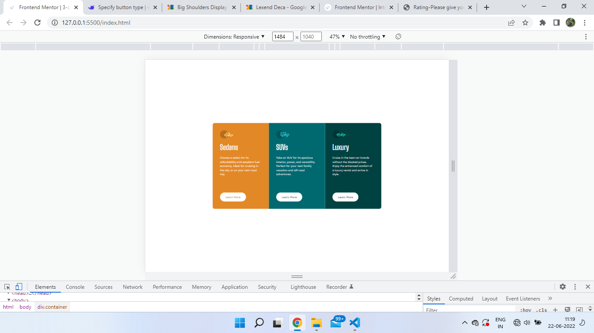
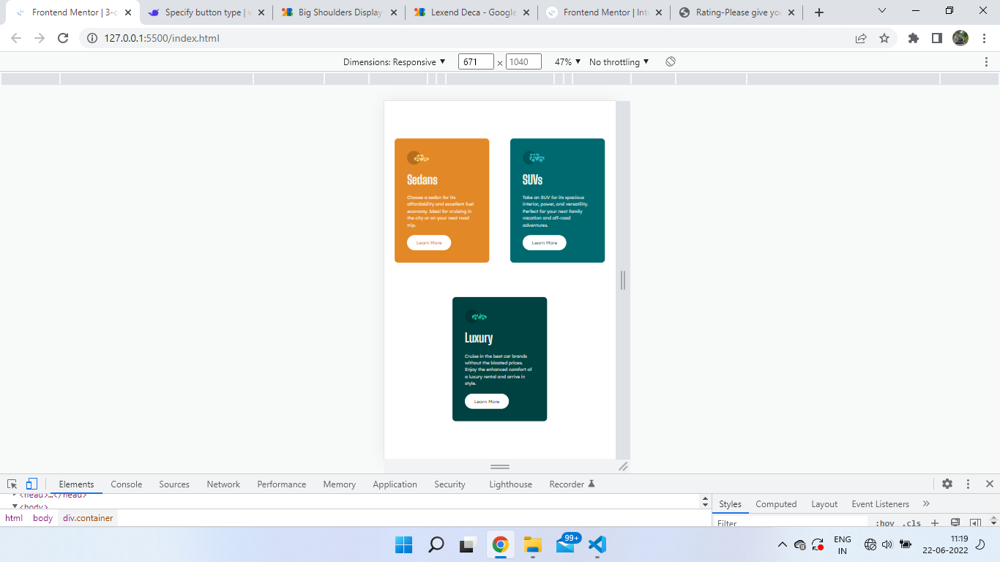
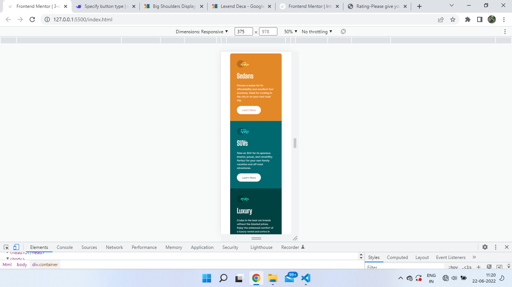

# Frontend Mentor - 3-column preview card component solution

This is a solution to the [3-column preview card component challenge on Frontend Mentor](https://www.frontendmentor.io/challenges/3column-preview-card-component-pH92eAR2-). Frontend Mentor challenges help you improve your coding skills by building realistic projects. 

## Table of contents

  - [The challenge](#the-challenge)
  - [Screenshot](#screenshot)
  - [Links](#links)
- [My process](#my-process)
  - [Built with](#built-with)
  - [What I learned](#what-i-learned)
  - [Continued development](#continued-development)
- [Author](#author)

### The challenge

Users should be able to:

- View the optimal layout depending on their device's screen size
- See hover states for interactive elements

### Screenshot
this is desktop view 

this is tablet view width 575px to 800px 

this is mobile view

### Links

- Solution URL: [Add solution URL here](https://your-solution-url.com)
- Live Site URL: [Add live site URL here](https://your-live-site-url.com)

## My process
i used mobile first workflow. i made the the webpage for mobile, then with media Queries i made it responsive for other devices.

### Built with

- Semantic HTML5 markup
- CSS custom properties
- Flexbox
- Mobile-first workflow

### What I learned
I learned how to make a webpage responsive with media queries. i am still not very familiar with it.
i learned mobile-first workflow. 

### Continued development

making a webpage responsive is my weakness. this is my weak area. I want to refine my techniques

## Author

- github - [@thapa14](https://github.com/thapa14)
- Frontend Mentor - [@thapa14](https://www.frontendmentor.io/profile/thapa14)
- Instagram - [@the_3_eyed_raven](https://www.instagram.com/the_3_eyed_raven/)

